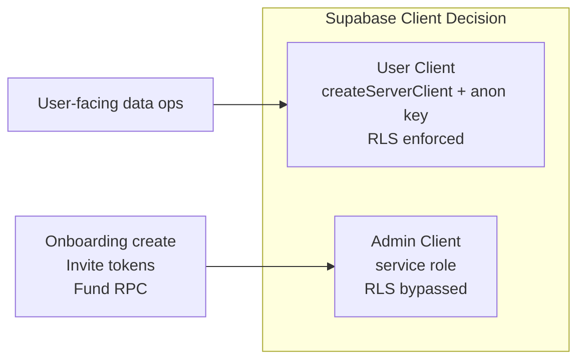

# GrowBase Architecture Spine

## Paradigm

**Layered Tenant-Scoped Server-Client.**

Three layers with strict downward dependency:

1. **Edge Middleware** — auth and onboarding gate, runs before any render
2. **Node.js API Layer** — domain logic, data access, security enforcement
3. **Browser Client Layer** — UI, optimistic state, cache

Tenant boundary = **Household**. Every domain entity carries `household_id`. No sub-boundary below household exists.

```mermaid
graph TD
  MW[Middleware — Edge\nAuth gate · Onboarding gate]
  API[API Routes — Node.js\nwithAuth · Membership verify · Supabase]
  CLIENT[Browser Client\nTanStack Query · Zustand · shadcn/ui]

  CLIENT -->|fetch /api/*| API
  MW -->|redirect on fail| LOGIN[/login · /setup]
  MW -->|pass| APP[(app) routes]
  APP --> CLIENT
```



---

## Stack

| Layer | Technology | Version |
|-------|-----------|---------|
| Framework | Next.js App Router | 14.2.x |
| Language | TypeScript strict | 5.7.x |
| Database | Supabase (Postgres + Auth) | supabase-js 2.46.x · ssr 0.5.x |
| Server state | TanStack Query | v5.62.x |
| Global state | Zustand | 5.0.x |
| Styling | Tailwind CSS + shadcn/ui Spike Admin | 3.4.x |
| Forms | React Hook Form + Zod | 7.54.x / 3.23.x |
| Charts | ApexCharts + react-apexcharts | 5.x / 2.x |
| Toasts | sonner | 1.7.x |
| i18n | Custom TranslationContext (vi default · en) | — |
| Icons | @iconify/react | — |
| Deployment | Self-hosted · Node.js runtime | — |

---

## Architectural Decisions

### AD-1 — Auth Invariant
**Binds:** Every API route author.  
**Prevents:** Silent auth bypass; inconsistent error shape between routes.  
**Rule:** Every API route calls `withAuth()` from `@/lib/supabase/auth-check` as its **first line**. Response shape is always `{ data: T | null, error: string | null }` — both fields present in every response.  
**[ADOPTED — bug exists in /api/household and /api/households: manual auth without withAuth() and non-standard response shape. Must fix.]**

### AD-2 — Supabase Client Model (Hybrid)
**Binds:** Every route author choosing which Supabase client to use.  
**Prevents:** Blanket admin client use that eliminates DB-level security; inconsistent security model across routes.  
**Rule:**
- **User-facing data operations** → `createServerClient` (anon key, RLS enforced, cookie session)
- **System operations** → `supabaseAdmin` (service role, RLS bypassed)

System operations are strictly: onboarding household + membership creation, invite token generation, fund balance RPCs (`contribute_to_fund`, `withdraw_from_fund`, `release_fund`), future admin panel ops.

### AD-3 — Household Switching State Contract
**Binds:** Anyone adding state to the Zustand store or TanStack Query cache.  
**Prevents:** Stale data from a previous household leaking after switch.  
**Rule:**
- `householdId` persists across refresh (localStorage/Zustand persist)
- On household switch: `householdId` updates → `currentMonth` resets to current month → TanStack Query cache auto-invalidates (all keys include `householdId`)
- Any new store state that is household-scoped MUST be cleared on switch or derived from a cache key that includes `householdId`

### AD-4 — Route Protection Model
**Binds:** Anyone adding new routes or layouts.  
**Prevents:** Auth check in layout (causes flash of unauthenticated content); missing protection on new routes.  
**Rule:** Auth and onboarding gates live **only in `src/middleware.ts`** (server-side, Edge). `(app)/layout.tsx` renders `<AppShell>` only — no auth logic. API routes (`/api/*`) are excluded from middleware and protected per-route by `withAuth()` (AD-1).

Gates in middleware:
1. No session → redirect `/login`
2. Session + `!onboarding_completed` → redirect `/setup`
3. Session + onboarded + on `/` or `/setup` → redirect `/dashboard`

### AD-5 — Runtime Model
**Binds:** Every route and middleware author.  
**Prevents:** `supabaseAdmin` crash on Edge runtime; unexpected Node.js-only API usage in middleware.  
**Rule:**
- API routes → Node.js runtime. Never declare `export const runtime = "edge"` in any route using `supabaseAdmin`
- `src/middleware.ts` → Edge runtime (Next.js mandatory). Use only `@supabase/ssr` `createServerClient`. `supabaseAdmin` is **forbidden** in middleware.

### AD-6 — Household Membership Double Guard
**Binds:** Every API route that accepts a `householdId` parameter.  
**Prevents:** User A accessing household B data by supplying a spoofed `householdId`.  
**Rule:** Every route touching household-scoped data must:
1. `withAuth()` → get authenticated user
2. Explicitly verify `user.id` is an active member of the target `householdId` (query `household_members`)
3. Execute operation

This applies even when using the user client with RLS. RLS is layer 2 (DB); route membership check is layer 1 (app). Both must pass.

---

## Adopted Invariants

These decisions are already enforced and stable. Do not re-derive.

| ID | Rule | Source |
|----|------|--------|
| A-1 | Fund balance mutations → always atomic Supabase RPC. Never direct INSERT/UPDATE on fund balance. | CLAUDE.md rule 1 |
| A-2 | `behavior_type` → DB trigger only. App code never writes this field. | CLAUDE.md rule 2 |
| A-3 | `is_system = true` records → immutable. No edit or delete. UI must guard. | CLAUDE.md rule 3 |
| A-4 | All TanStack Query keys via `keys.*` factory from `@/lib/queries/queryKeys`. Never hardcode key arrays. | project-context |
| A-5 | All UI strings via `t()` from `useTranslation()`. No hardcoded Vietnamese or English text in components. | project-context |
| A-6 | `page.tsx` = thin wrapper rendering `<FeatureClient />`. All logic, state, queries in `FeatureClient.tsx` (`"use client"`). | project-context |
| A-7 | `householdId` sourced from Zustand store only — never from URL params or request body without AD-6 verification. | project-context |

---

## Boundaries & Dependency Rules

```
Browser Client
  └── may call: /api/* routes only (never Supabase directly)
  └── may read: Zustand store, TanStack Query cache
  └── must not: import server-only modules, call Supabase JS from component

API Routes (Node.js)
  └── must call: withAuth() first (AD-1)
  └── must verify: household membership before data access (AD-6)
  └── may use: user client OR admin client (AD-2 decides which)
  └── must not: export const runtime = "edge" (AD-5)

Middleware (Edge)
  └── may use: @supabase/ssr createServerClient only
  └── must not: import supabaseAdmin (AD-5)
  └── must not: perform business logic — gate only
```

---

## File Structure (Seed)

```
src/
├── middleware.ts                     # Edge auth/onboarding gate
├── app/
│   ├── (app)/                        # Protected routes
│   │   └── {feature}/
│   │       ├── page.tsx              # Thin wrapper → <FeatureClient />
│   │       └── loading.tsx
│   ├── api/
│   │   └── {entity}/
│   │       ├── route.ts              # GET, POST — withAuth() first
│   │       └── [id]/route.ts         # GET, PATCH, DELETE
│   ├── login/                        # Public
│   └── setup/                        # Onboarding wizard
├── components/{feature}/
│   ├── {Feature}Client.tsx           # "use client" — all logic here
│   └── {Feature}Form.tsx
├── lib/
│   ├── hooks/use{Entity}.ts          # TanStack Query hooks
│   ├── queries/queryKeys.ts          # keys.* factory
│   ├── stores/appStore.ts            # Zustand: householdId, currentMonth, user
│   ├── supabase/
│   │   ├── auth-check.ts             # withAuth() — mandatory first call
│   │   ├── server.ts                 # createClient() user client
│   │   └── admin.ts                  # supabaseAdmin — system ops only
│   └── validations/{entity}.ts       # Zod schemas
└── types/app.ts                      # All domain types
```

---

## Open Questions

| # | Question | Blocker? |
|---|----------|---------|
| OQ-1 | `households` table RLS status — middleware queries it with anon key (user client). Must verify enabled policies before RLS migration of other tables. | Yes — before hybrid migration |

---

## Deferred

| # | Decision | Revisit when |
|---|----------|-------------|
| D-1 | Write RLS policies for transactions, funds, accounts, budget, categories, income_sources, debt_entries. Pattern: `auth.uid() IN (SELECT user_id FROM household_members WHERE household_id = table.household_id AND is_active = true)` | Hybrid migration sprint begins |
| D-2 | Admin panel feature scope and auth model (separate from household user flows) | Admin panel sprint |
