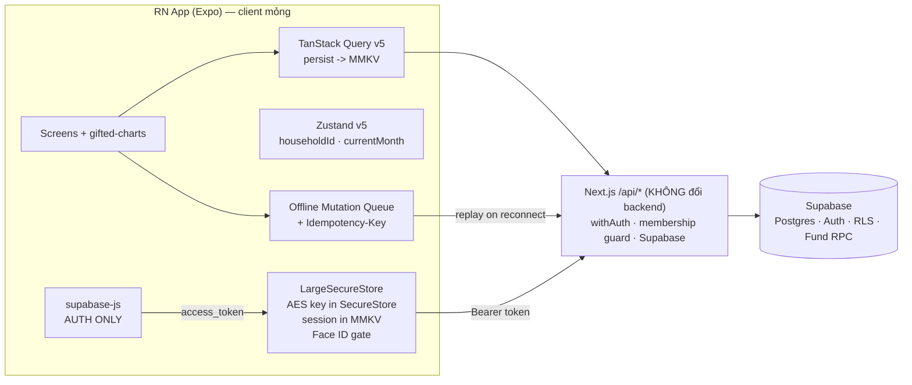

# Architecture Spine — GrowBase Mobile

## 1. Paradigm

**Offline-first Thin Native Client over Shared API.**

RN app là **client mỏng**: chỉ trình bày + hàng đợi offline, **không chứa business logic** riêng. Mọi dữ liệu đi qua `/api/*` của web Next.js sẵn có; backend/DB/security **không đổi**. Mobile là "client layer thứ hai" bên cạnh browser — kế thừa nguyên security model của web.



## 2. Inherited Invariants (từ web spine `architecture-growbase-2026-06-27`, read-only)

Binding, không re-derive. Vi phạm = conflict phải surface, không override cục bộ.

| ID gốc | Nội dung |
|---|---|
| AD-1 | Mọi `/api` route gọi `withAuth()` dòng đầu; response `{ data, error }`. |
| AD-2 | User client vs `supabaseAdmin`. System ops (fund RPC `contribute/withdraw/release`, onboarding, invite) = `supabaseAdmin` service-role **server-side only**. |
| AD-6 | Household membership double-guard: check ở API route (app) + RLS (DB). |
| A-1 | Fund balance mutation = atomic Supabase RPC. Không INSERT/UPDATE trực tiếp. |
| A-3 | `is_system=true` immutable, readonly trong UI. |
| A-4 | Query keys qua `keys.*` factory. Không hardcode. |
| A-5 | Mọi UI string qua `t()` — không hardcode chuỗi. |
| A-7 | `householdId` từ Zustand store, không từ URL/body chưa qua AD-6. |
| Boundary | Client layer chỉ gọi `/api/*`, **không bao giờ** gọi Supabase trực tiếp (cho data). |

## 3. Architecture Decisions (mobile)

### AD-M1 — Client-to-API boundary `[ADOPTED]`
**Binds:** mọi tác giả truy cập dữ liệu ở mobile.
**Prevents:** bỏ qua membership guard (AD-6), phá security fund-ops (AD-2), logic drift.
**Rule:** Mọi đọc/ghi dữ liệu qua `fetch` tới `/api/*`. `supabase-js` chỉ dùng cho **auth** (login, refresh, lấy `access_token`) — không dùng cho data.

### AD-M2 — Auth transport (Bearer)
**Binds:** auth mobile + mọi call `/api` từ mobile + `withAuth()`.
**Prevents:** giả định cookie-only làm vỡ native client.
**Rule:** `supabase-js` (RN) lo login + auto-refresh; gắn `Authorization: Bearer <access_token>` vào mọi request `/api`. **⚠️ BACKEND TOUCH:** `withAuth()` phải chấp nhận Bearer token bên cạnh cookie session.

### AD-M3 — Session at rest + biometric
**Binds:** lưu session + luồng unlock.
**Prevents:** session không mã hóa; lỗi SecureStore khi session > 2048 bytes.
**Rule:** **LargeSecureStore** — khóa AES-256 trong `expo-secure-store`, session mã hóa lưu MMKV. **Không** để raw session trong SecureStore. `expo-local-authentication` (Face ID/fingerprint) gate mở app, fallback passcode. supabase-js config: `autoRefreshToken:true`, `persistSession:true`, `detectSessionInUrl:false`, start/stop refresh theo `AppState`.

### AD-M4 — Offline model
**Binds:** mọi mutation mobile + `/api` mutation routes.
**Prevents:** mất dữ liệu offline; bản ghi trùng khi retry (NFR-5, SM-C1).
**Rule:** Đọc từ TanStack Query cache đã persist (`persistQueryClient` + MMKV, `gcTime >= maxAge`). Ghi → đẩy vào **durable local mutation queue**, replay tuần tự khi online lại. Mỗi mutating call mang **client-generated Idempotency-Key**. **⚠️ BACKEND TOUCH:** `/api` mutation routes phải dedupe theo Idempotency-Key.
**Eligibility:** chỉ queue mutation **không nhạy số dư** (transaction create/edit/delete). Op nhạy số dư (fund RPC — A-1) là **online-only** và ngoài mobile v1 (FR-15) → không vào queue (tránh replay trên balance cũ).
**Replay-failure:** 4xx conflict → surface cho user + drop khỏi queue; 5xx/network → retry backoff. Mỗi transaction có **sync status** (pending/synced/error) hiển thị lên UI (FR-20).

### AD-M5 — Shared code (monorepo)
**Binds:** mọi code đụng types / rules / query-keys chung.
**Prevents:** drift giữa web ↔ mobile (NFR-6).
**Rule:** Chuyển repo sang **pnpm workspace**; `packages/shared` chứa TypeScript types, Zod schemas, pure business rules, query-key factory `keys.*` — cả web và mobile consume, **không duplicate**. Metro cấu hình symlink theo `expo-monorepo-example` (`unstable_enableSymlinks` + `unstable_enablePackageExports`), đảm bảo 1 instance react/react-native.

### AD-M6 — Client conventions mirror web
**Binds:** tác giả data/state mobile.
**Prevents:** pattern state/cache phân kỳ.
**Rule:** TanStack Query v5 + Zustand v5; query keys qua `keys.*` (A-4); `householdId` + `currentMonth` chỉ từ Zustand store (A-7). **Một storage layer duy nhất = MMKV** cho cả query-cache persist lẫn Zustand persist.

### AD-M9 — Household-scoped cache
**Binds:** persist cache + luồng switch household / logout.
**Prevents:** rò rỉ dữ liệu chéo household từ MMKV cache đã persist (kế thừa contract AD-3 web).
**Rule:** Persisted query cache phân vùng theo `householdId`. Switch household → **purge + invalidate** cache đã persist trước khi load household mới. Logout → clear toàn bộ cache + session.

### AD-M10 — i18n & theme
**Binds:** mọi UI mobile.
**Prevents:** copy/theme phân kỳ với web (FR-5, NFR-7).
**Rule:** Dùng lại catalog string chung + `t()` (A-5) và theme tokens; **không** hardcode chuỗi/màu. vi mặc định + en; light/dark.

### AD-M7 — Notification model v1
**Binds:** tính năng nhắc ghi chép.
**Prevents:** dựng push infra sớm không cần thiết.
**Rule:** v1 chỉ **local scheduled notification** (`expo-notifications`, trigger `{hour,minute,repeats:true}` + Android channel). **Không** push server / FCM / APNs ở v1.

### AD-M8 — Environments & deploy
**Binds:** cấu hình build + env.
**Prevents:** hardcode API endpoint; nhầm môi trường.
**Rule:** Build qua **Expo EAS** → App Store + Play Store. Base URL `/api` từ env config (dev: tunnel/localhost; prod: domain web đã hosted). Native `fetch` không chịu browser CORS. **OTA** qua `expo-updates` (EAS Update) cho fix JS-only. **Crash/error reporting** bắt buộc (Sentry hoặc expo built-in). Client gửi `app-version` header để backend gate min-version (vì AD-M2/M4 đổi contract `/api`).

## 4. Stack (seed — đúng ở cold-start, code sở hữu sau đó)

| Layer | Choice | Version (2026-07) |
|---|---|---|
| Runtime | Expo (CNG managed) | SDK 56 (RN 0.86, React 19.2) |
| Navigation | Expo Router (typedRoutes) | v6 |
| Server data | TanStack Query | v5 |
| Client state | Zustand | v5 |
| Storage | react-native-mmkv | 3.x |
| Cache persist | @tanstack/query-async-storage-persister (MMKV) | 5.x |
| Auth | @supabase/supabase-js (auth only) | 2.x |
| Secure store | expo-secure-store + LargeSecureStore | bundled SDK 56 |
| Biometric | expo-local-authentication | bundled SDK 56 |
| Notifications | expo-notifications (local) | bundled SDK 56 |
| OTA / crash | expo-updates + Sentry | bundled SDK 56 |
| Charts | react-native-gifted-charts | 1.4.x |
| Monorepo | pnpm workspaces (+ Turborepo optional) | — |

**Performance budget (NFR-1, giữ bằng đo, không phải fix bằng kiến trúc):** cold start → màn nhập ≤ 3s; chạm icon → lưu 1 giao dịch < 15s end-to-end.

## 5. Repo shape (seed)

```
growbase/ (pnpm workspace)
├── apps/
│   ├── web/            # Next.js hiện tại (di chuyển vào đây)
│   └── mobile/         # Expo app (mới)
│       ├── app/        # Expo Router screens
│       ├── src/
│       │   ├── api/        # fetch client -> /api/* (Bearer, Idempotency-Key)
│       │   ├── auth/       # supabase-js auth + LargeSecureStore + biometric
│       │   ├── offline/    # mutation queue + replay
│       │   ├── query/      # TanStack Query client + MMKV persist
│       │   └── store/      # Zustand (householdId, currentMonth)
│       └── metro.config.js # monorepo symlink config
└── packages/
    └── shared/         # types · Zod · business rules · keys.* factory
```

## 6. Deferred (không quyết ở đây)

- **Remote push** (FCM/APNs) cho cảnh báo budget / scheduled-due → v2.
- **OCR / photo capture** pipeline → v2.
- **EAS Build/Submit profiles** + store release chi tiết → khi vào build.
- **Turborepo caching** — optional, không bắt buộc cho Metro.
- **Commercialization backend** (scaling, pricing, multi-tenant) → sau 3 tháng.
- **Switch household / đổi tháng UX** → `bmad-ux` sở hữu.
- **Onboarding tour mobile** (FR-2): driver.js là web-only → cần mô hình tour native → `bmad-ux`. Data/logic onboarding (income step) dùng chung qua `packages/shared`.

## 7. Open Questions

- `[ASSUMPTION]` Web repo hiện là single-package → cần migrate sang pnpm workspace (`apps/web`). Xác nhận chấp nhận việc restructure này (ảnh hưởng import paths, CI).
- 2 backend touch (AD-M2 Bearer, AD-M4 Idempotency-Key): xác nhận sẵn sàng sửa web `/api`.
- Env base-URL cho dev: dùng Expo tunnel hay LAN IP tới Next.js dev server — chốt khi setup.
